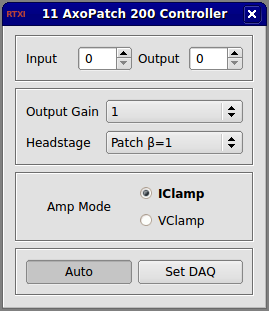

###Axon AxoPatch 200 Controller

**Requirements:** None  
**Limitations:** None  

<!--start-->
Amplifier control module to compensate for scaling properties of the Axon AxoPatch 200 controller. This module essentially acts as an interface that augments the control panel in that it allows you to set input/output gains with a few button clicks instead of manually entering every value.  
<!--end-->

**Note:** You will still need to open the system control panel to activate channels. This module will not do that for you.  

####Input Channels
1. input(0) - Mode Telegraph : the telegraph used in Auto mode
2. input(0) - Gain Telegraph : the telegraph used in Auto mode

####Output Channels
None

####Parameters
1. Input Channel - input channel to scale (#)
2. Output Channel - output channel to scale (#)
3. Headstage Gain - gain set by the headstage
4. Output Gain - output gain from amplifier
5. Amplifier Mode - mode setting on the amplifier (vclamp or iclamp)

####States
None
