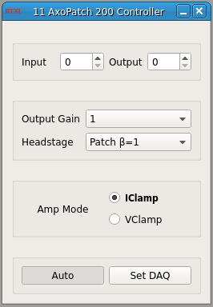

###Axon AxoPatch 200 Controller

**Requirements:** None  
**Limitations:** None  

<!--start-->
Amplifier control module to compensate for scaling properties of the Axon AxoPatch 200 controller. This module essentially acts as an interface that replicated functionality of the control panel, but in a manner specific to the controller's own functionality. 
<!--end-->

####Input Channels
1. input(0) - Mode Telegraph : the telegraph used in Auto mode
2. input(0) - Gain Telegraph : the telegraph used in Auto mode

####Output Channels
None

####Parameters
1. Input Channel
2. Output Channel 
3. Headstage Gain
4. Output Gain
5. Amplifier Mode

####States
None
